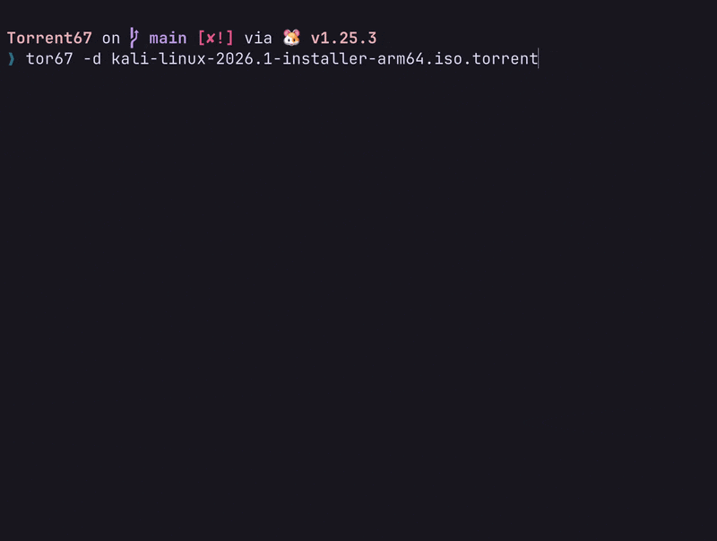

# Tor67 <3



A lightweight, custom BitTorrent client built from scratch in Go. 

Tor67 bypasses the bloat of modern UI-heavy clients, providing a raw, high performance CLI engine for parsing `.torrent` files, communicating with trackers, and downloading files via a concurrent P2P swarm.

## Features
* **Built from Scratch:** Custom implementation of the BitTorrent Peer Wire Protocol.
* **Highly Concurrent:** Utilizes Go's Goroutines to spin up a massive worker pool, downloading pieces from dozens of peers simultaneously.
* **Multi Tracker Support:** Parses `announce-list` to scrape fallback HTTP/HTTPS trackers.
* **Cryptographic Verification:** Verifies incoming blocks against SHA-1 piece hashes to ensure absolute data integrity.
* **Cross Platform:** Statically compiled standalone binaries for macOS (Apple Silicon/Intel), Windows, and Linux.

## Installation

You can download the pre compiled binaries from the `build/` directory, or compile it yourself if you have Go installed:

```bash
git clone https://github.com/jagath-sajjan/Torrent67.git
cd Torrent67
go build -o tor67 main.go
```

### Global Installation (Run from anywhere)
To use `tor67` from any directory without needing the `./` prefix, add it to your system path.

**macOS & Linux:**
Move the compiled binary into your local binaries folder.
```bash
sudo mv tor67 /usr/local/bin/
```

**Windows:**
1. Create a permanent folder for the app (e.g., `C:\Program Files\Tor67`).
2. Move your compiled `tor67-win64.exe` into that folder and rename it to `tor67.exe`.
3. Open the Windows Start Menu, search for **"Environment Variables"**, and hit enter.
4. Click the **Environment Variables...** button.
5. Under "System variables", select the `Path` variable and click **Edit**.
6. Click **New**, paste the path to your folder (`C:\Program Files\Tor67`), and hit OK. 
7. Restart your terminal.

## Usage
Once installed globally, Tor67 acts as a standard UNIX style CLI utility.

**View Torrent Metadata:**
```bash
tor67 -i ubuntu.torrent
```

**Scrape Trackers & List Active Peers:**
```bash
tor67 -cp ubuntu.torrent
```

**Download the File (defaults to current directory):**
```bash
tor67 -d ubuntu.torrent
```

**Download the File to a Specific Location:**
```bash
tor67 -d ubuntu.torrent -loc /Users/Shared/Downloads
```

## License
This project is licensed under the MIT License > see the [LICENSE](LICENSE) file for details.
